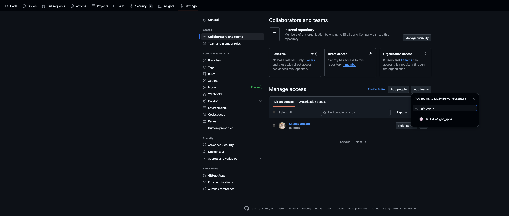
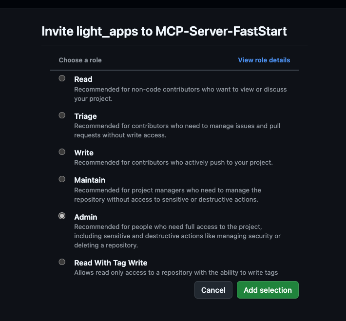
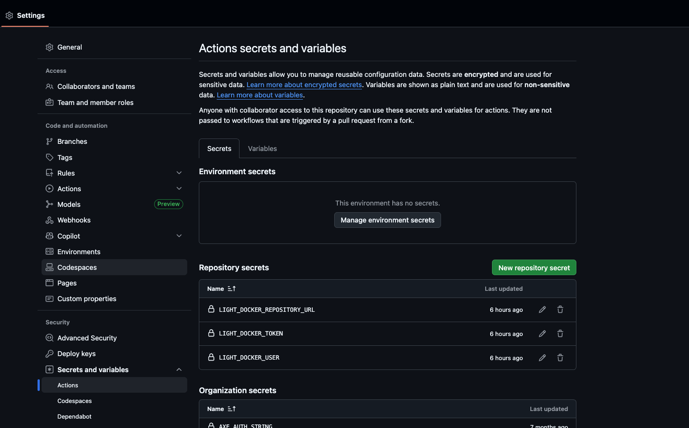

# Deployment Guide

## Prerequisites

Before deploying your MCP server, you need to set up the necessary GitHub repository configs and access permissions. This guide will walk you through the steps to prepare your repository for deployment.


### 1. Add the Light Apps Team to Your Repository

First, you need to add the **Light Apps team** to your GitHub repository with admin access:

1. Navigate to your GitHub repository
2. Go to **Settings** → **Manage access** → **Invite teams or people**
3. Search for and add the **Light Apps team**
4. **Important**: Grant the team **Admin** access to your repository





### 2. Wait for Automatic Secret Configuration

Once you've added the Light Apps team with admin access, they will automatically add the necessary deployment secrets to your repository within a few hours. 

**You'll know the setup is complete when you see the following secrets in your repository settings** (Settings → Secrets and variables → Actions):

- AWS deployment credentials
- ECR registry access tokens
- Other required environment variables



> ⚠️ **Important**: Do not proceed with deployment until you see these secrets in your repository. Their presence indicates that the automatic workflow has run successfully and your repository is ready for deployment.

## Automated Deployment Process

Once the prerequisites are complete, the deployment process is fully automated through GitHub Actions.

### How the Deployment Works

The GitHub Actions workflow will automatically trigger when you push code to either:
- `dev` branch
- `main` branch

### What the Workflow Does

When triggered, the automated workflow performs the following steps:

1. **Authentication**: Uses the recently added secret credentials to authenticate with the CATS AWS account
2. **Docker Build**: Builds a Docker image of your MCP tool server using the `Dockerfile` in your repository
3. **ECR Push**: Pushes the built image to an Amazon ECR (Elastic Container Registry) repository
   - The ECR repository will have the **same name as your GitHub repository**
   - Images are tagged with the commit SHA for traceability

> 📝 **Note**: After the GitHub Actions workflow completes, you'll need to retrieve the **image SHA value**. You can find this by:
> - Checking the GitHub Actions run logs, or
> - Logging into the CATS AWS account → ECR → Your repository → Get the SHA value

## CATS Platform Access Prerequisites

Before deploying, you must have access to the CATS Platform. Use the **Developer FRONTDOOR** to automatically join these required groups:

### 1. GitHub Access
- **Group**: `LRL_light_k8s_infra_write`
- **Purpose**: Access to CATS Platform repositories
- **Requirements**: Eli Lilly GitHub Organization membership
- **Action**: Use FRONTDOOR to auto-join

### 2. Dashboard Access
- **Group**: `lrl_cats_access_non_rids`
- **Purpose**: Access to CATS Platform dashboards
- **Action**: Use FRONTDOOR to auto-join 

### 3. AWS Console Access
- **Group**: `aws_light_devs`
- **Purpose**: AWS Console and cluster access
- **Requirements**: CA Account required
- **Action**: Get CA Account, then use FRONTDOOR to auto-join

> 💡 **Access All Groups**: Navigate to the Developer FRONTDOOR at https://dev.lilly.com/docs/platforms-and-tools/cats/#onboarding-and-offboarding and use the automated options on the CATS Page for each group. The system will guide you through any missing requirements.

## Next Steps

After completing both the repository prerequisites and platform access requirements, you're ready to deploy by pushing your code to the `dev` or `main` branch. The automated pipeline will handle the rest!

## Monitor GitHub Actions and Retrieve SHA

### 1. Push Code to Trigger Deployment

Push your code to either `dev` or `main` branch to trigger the GitHub Actions workflow:

```bash
git push origin dev
# or
git push origin main
```

### 2. Monitor GitHub Actions

Go to your repository's **Actions** tab to monitor the workflow progress. The workflow will:
- Authenticate with CATS AWS account
- Build your Docker image
- Push the image to ECR

### 3. Retrieve Image SHA Value

Once the GitHub Actions workflow completes successfully, retrieve the **image SHA value**:
- Check the GitHub Actions run logs for the SHA value, or
- Log into CATS AWS account → ECR → Your repository → Get the SHA value

## Configure Deployment Settings

### 1. Navigate to Helm Directory

Go to the `helm` directory in your project:

```bash
cd helm
```

### 2. Update Values File

Open the `values-cats.dev.yaml` file and update ALL values to match your project specifications:

```bash
# Edit the values file with your preferred editor
vim values-cats.dev.yaml
# or
code values-cats.dev.yaml
```

> ⚠️ **CRITICAL**: Update the `initialSha` key with the image SHA value from your GitHub Actions workflow:

```yaml
toolServer:
  # ... other configuration
  initialSha: your-actual-sha-value-here
```

Also update other values such as:
- Application name
- Namespace name
- Resource limits
- Environment variables
- Service configuration

### 3. Generate Kubernetes Templates

After updating all values (especially the `initialSha`), generate the Kubernetes templates:

```bash
make templates
```

This command will:
- Use your configured values from `values-cats.dev.yaml` (including the updated `initialSha`)
- Generate the Kubernetes manifests
- Output the templates to `helm/cortex-tool-template/templates/` folder

> 💡 **Tip**: Review the generated templates in the `helm/cortex-tool-template/templates/` folder to ensure they match your expected configuration before proceeding with deployment.

## Deploy to CATS Infrastructure

### 1. Access the CATS Infrastructure Repository

Clone or open the CATS infrastructure repository: https://github.com/EliLillyCo/LRL_light_k8s_infra_apps

```bash
# Clone the repository
git clone https://github.com/EliLillyCo/LRL_light_k8s_infra_apps.git
cd LRL_light_k8s_infra_apps

# Or open directly in Codespaces from GitHub
```

### 2. Create a New Branch

```bash
git checkout -b deploy-your-app-name
```

### 3. Verify Namespace Name

**Important**: Ensure your namespace name ends with "dev" before proceeding. Check your namespace configuration file to confirm.

### 4. Create Project Directory

Navigate to the projects/dev path and create a folder with the same name as your namespace:

```bash
cd projects/dev
mkdir your-namespace-name-dev
cd your-namespace-name-dev
```

### 5. Copy Kubernetes Configuration Files

Copy all 4 Kubernetes configuration files from your generated templates to this directory in a **flat structure** (no subfolders):

```bash
# Copy the files from your project's helm/cortex-tool-template/templates/ folder
# to the current directory in the CATS infrastructure repo
cp /path/to/your/project/helm/cortex-tool-template/templates/* .
```

The directory should contain:
- Deployment configuration
- Service configuration  
- Ingress configuration
- Any other generated K8s manifests

### 6. Submit for Deployment

1. **Push your changes**:
   ```bash
   git add .
   git commit -m "Add deployment config for your-namespace-name-dev"
   git push origin deploy-your-app-name
   ```

2. **Create a Pull Request**:
   - Go to the [CATS Infrastructure Repository](https://github.com/EliLillyCo/LRL_light_k8s_infra_apps)
   - Open a PR from your branch to `main`
   - Wait for approval from CATS admin

3. **Merge and Deploy**:
   - Once approved, merge the PR
   - Your deployment will be automatically processed

### 7. Monitor Your Deployment

After merging the PR, your deployment will be automatically processed and you can monitor the deployment at the ArgoCD dashboard:

🔗 **ArgoCD Dashboard**: https://argocd.apps.lrl.lilly.com/
