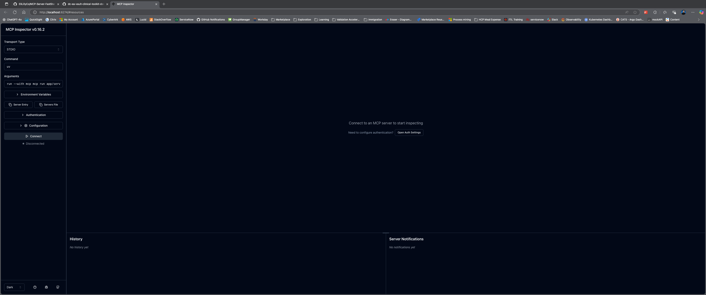
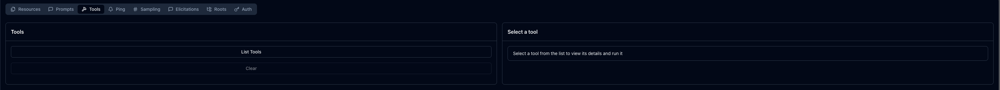
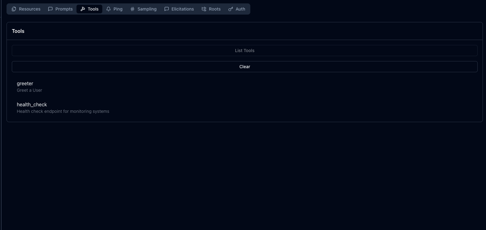
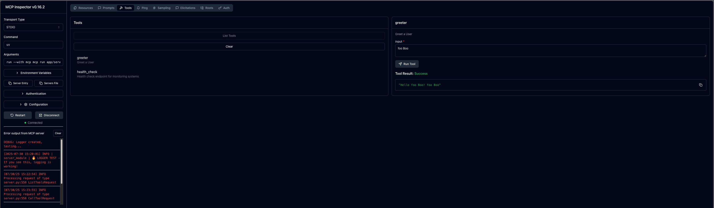

# A fast starter/accelerator for quickly spinning up Model Context Protocol (MCP) servers. This repository provides a production-ready template with logging, monitoring, containerization, and Kubernetes deployment capabilities built-in.

## 📥 Get Started: Clone the Repository

First, clone this repository to your local machine and navigate into it:

```bash
git clone https://github.com/EliLillyCo/MCP-Server-FastStart.git
cd MCP-Server-FastStart
```

## 📋 Prerequisites-Server-FastStart

A fast starter/accelerator for quickly spinning up Model Context Protocol (MCP) servers. This repository provides a production-ready template with logging, monitoring, containerization, and Kubernetes deployment capabilities built-in.

## � Prerequisites

Before you begin, ensure you have the following installed on your system:

### Required:
- **Python 3.13+** - Required for running the MCP server
  - Check with: `python3 --version` or `python --version`
  - Download from: [python.org](https://www.python.org/downloads/)
  
- **Node.js (v18+)** - Required for MCP Inspector (the testing tool)
  - Check with: `node --version`
  - Download from: [nodejs.org](https://nodejs.org/)

## �🚀 Quick Start

1. **Setup the environment:**
   ```bash
   make setup
   # First run installs uv package manager and sets up the virtual environment. [ERROR IS EXPECTED HERE ⚠️]
   # ENSURE THAT YOU RESTART YOUR SHELL AND THEN RUN THIS COMMAND AGAIN. 🧨
   make setup
   ```

2. **Start the server:**
   ```bash
   make server
   ```

3. **Create your tools** by editing `app/server.py` (see syntax below)

## Testing Your Tools with MCP Inspector

When you run `make server`, your MCP server starts and automatically opens the **MCP Inspector** - a web-based tool for testing your MCP tools. Here's what happens:


### What `make server` Does:
1. **Starts your MCP server** with your custom tools loaded
2. **Opens MCP Inspector** in your browser automatically  
3. **Connects the inspector** to your running server
4. **Makes your tools available** for testing immediately

### How to Use MCP Inspector:

#### 🎯 **Step 1: Connect to Your Server**
- The MCP Inspector opens automatically in your browser
- You'll see the main interface with a **"Connect"** button
- Click the **"Connect"** button to establish connection with your running server


#### 🔧 **Step 2: Navigate to Tools**
- Once connected, you'll see navigation options
- Click on the **"Tools"** tab or section


#### �️ **Step 3: View Available Tools** 
- All your custom tools from `app/server.py` will be listed
- You'll see the built-in example tools:
  - `greeter` - Simple greeting tool
  - `health_check` - Server health monitoring
- Any new tools you create will appear here automatically


#### ▶️ **Step 4: Execute a Tool**
- Click on any tool name to select it
- Fill in the required parameters (if any)
- Click **"Run"** or **"Execute"** button
- View the results in real-time
- Check the server logs for detailed execution information


### 💡 **Pro Tips:**
- **Live Reload**: When you edit `app/server.py`, restart with `make server` to see your changes
- **Error Debugging**: Failed tool executions show detailed error messages
- **Logging**: All tool executions are logged with timestamps and performance metrics
- **Parameter Testing**: Try different input values to test your tool's validation and error handling

## 📁 Repository Structure

```
MCP-Server-FastStart/
├── app/
│   ├── server.py          # 🎯 MAIN FILE - Edit this to create your MCP tools
│   ├── logger.py          # Logging utilities (pre-configured)
│   ├── middleware.py      # Request middleware (pre-configured)
│   └── __init__.py
├── helm/                  # Kubernetes deployment manifests
│   ├── Chart.yaml
│   ├── values-*.yaml      # Environment-specific configurations
│   └── templates/         # Helm chart templates
├── Dockerfile             # Container configuration
├── Makefile              # Automation scripts
├── requirements.txt      # Python dependencies
└── README.md
```

## ✨ The Only File You Need to Edit

**`app/server.py`** is the single file you need to modify to create your MCP tools. Everything else is pre-configured infrastructure that handles:

- ✅ Logging and monitoring
- ✅ Error handling and metrics
- ✅ Health checks
- ✅ Request middleware
- ✅ Container deployment
- ✅ Kubernetes orchestration

## 🛠️ FastMCP Tool Syntax

This repository uses the FastMCP framework. Here's how to create tools:

### Basic Tool Structure

```python
@mcp.tool()
def your_tool_name(parameter: str) -> str:
    """
    Description of what your tool does
    
    Args:
        parameter: Description of the parameter
        
    Returns:
        Description of what is returned
    """
    start_time = time.time()
    tool_name = "your_tool_name"
    
    try:
        logger.info(f"🔧 TOOL_START | {tool_name} | Input: {parameter}")
        
        # Your tool logic here
        result = f"Processed: {parameter}"
        
        # Log success metrics
        duration = time.time() - start_time
        log_request_metrics(logger, server_stats, tool_name, True, duration)
        
        return result
        
    except Exception as e:
        # Log error metrics
        duration = time.time() - start_time
        logger.error(f"🚨 TOOL_ERROR | {tool_name} | Error: {str(e)}")
        log_request_metrics(logger, server_stats, tool_name, False, duration)
        return f"Error in {tool_name}: {str(e)}"
```

### Example Tools

The repository includes two example tools:

1. **`greeter(input: str)`** - A simple greeting tool
2. **`health_check()`** - Server health monitoring

### Key Patterns to Follow

1. **Use the `@mcp.tool()` decorator** on all tool functions
2. **Include comprehensive docstrings** with Args and Returns sections
3. **Add logging** using the provided logger patterns:
   - `logger.info()` for tool start/success
   - `logger.error()` for errors
   - `log_request_metrics()` for performance tracking
4. **Wrap in try-catch blocks** for proper error handling
5. **Use type hints** for parameters and return values

### Advanced Tool Example

```python
@mcp.tool()
def process_data(data: str, format_type: str = "json") -> str:
    """
    Process data in various formats
    
    Args:
        data: The data to process
        format_type: Output format (json, xml, csv)
        
    Returns:
        Processed data in the specified format
    """
    start_time = time.time()
    tool_name = "process_data"
    
    try:
        logger.info(f"🔧 TOOL_START | {tool_name} | Format: {format_type}")
        
        # Validate inputs
        if not data:
            raise ValueError("Data parameter cannot be empty")
            
        if format_type not in ["json", "xml", "csv"]:
            raise ValueError("Invalid format_type. Use: json, xml, or csv")
        
        # Process the data
        if format_type == "json":
            result = json.dumps({"processed": data})
        elif format_type == "xml":
            result = f"<data>{data}</data>"
        else:  # csv
            result = f"processed,{data}"
        
        # Log success
        duration = time.time() - start_time
        log_request_metrics(logger, server_stats, tool_name, True, duration)
        
        return result
        
    except Exception as e:
        duration = time.time() - start_time
        logger.error(f"🚨 TOOL_ERROR | {tool_name} | Error: {str(e)}")
        log_request_metrics(logger, server_stats, tool_name, False, duration)
        return f"Error in {tool_name}: {str(e)}"
```

## 🔧 Development Workflow

1. **Edit `app/server.py`** to add your tools
2. **Test locally** with `make server`
3. **Deploy to CATS** for request metrics and errors

## 📊 Built-in Features

- **Comprehensive Logging**: All requests, errors, and metrics are logged
- **Health Monitoring**: Built-in health check endpoint
- **Performance Metrics**: Request duration and success rate tracking
- **Graceful Shutdown**: Proper signal handling for container environments
- **Production Ready**: Includes Dockerfile and Kubernetes manifests

## 🐳 Container Deployment

The repository includes a production-ready Dockerfile and Kubernetes Helm charts in the `helm/` directory for easy deployment to cloud environments.


**🚀🚀🚀Happy building! 🚀🚀🚀** Start by editing `app/server.py` and create amazing MCP tools!

---

